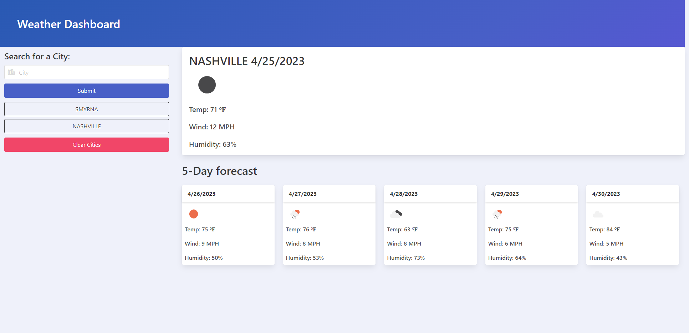

# weather-web-app

## Description

A web application that allows users to search for cities and view the current and future weather conditions.

## Usage

1. Enter a city name in the search input and click the search button.

2. The current weather conditions for the entered city will be displayed along with a 5-day forecast.

3. To view the weather for a previous city, click on the respective city button in the search history section.

4. To delete the search history, click the Clear Cities button.

## Technologies

* [Open Weather API](https://openweathermap.org/api)
* [Bulma](https://bulma.io/)
* [Font Awesome](https://fontawesome.com/)

## Resources

[Deployed Link](https://zgibbs58.github.io/weather-web-app/)

[Repo Link](https://github.com/Zgibbs58/weather-web-app)

## Screen

